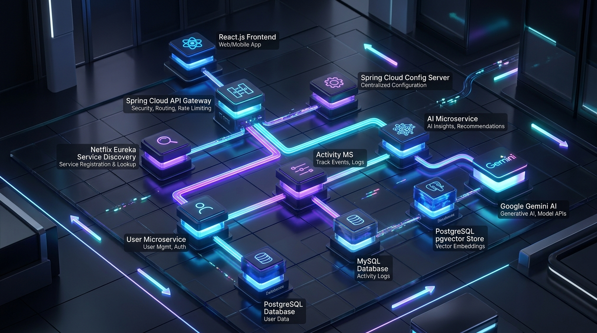

# Fitness Application – Cloud-Native Microservices Platform 🏋️‍♂️⚡

[](https://www.oracle.com/java/)
[](https://spring.io/projects/spring-boot)
[](https://spring.io/projects/spring-cloud)
[](https://reactjs.org/)
[](https://www.postgresql.org/)
[](https://www.mysql.com/)
[](https://github.com/langchain4j/langchain4j)
[](https://ai.google.dev/)
[](https://www.docker.com/)

A high-throughput, cloud-native microservices platform engineered for real-time fitness metric tracking, activity aggregation, and AI-powered exercise & nutrition recommendations. Built following strict **Database-Per-Service** architecture, **RAG (Retrieval-Augmented Generation)** knowledge retrieval using `pgvector`, and a responsive **React.js dashboard with 5-second real-time metrics auto-refresh**.

---

## 🏛️ System Architecture



The platform is designed around 6 decoupled, single-responsibility distributed backend services orchestrated via Spring Cloud infrastructure and containerized via Docker Compose:

```
                                   ┌─────────────────────────────────┐
                                   │   React.js Real-time Dashboard  │
                                   │ (5-Second Metric Refresh Loop)  │
                                   └────────────────┬────────────────┘
                                                    │
                                           ┌────────▼────────┐
                                           │  API Gateway    │
                                           │   (Port 8080)   │
                                           └────────┬────────┘
                                                    │
                   ┌────────────────────────────────┼────────────────────────────────┐
                   │                                │                                │
          ┌────────▼────────┐              ┌────────▼────────┐              ┌────────▼────────┐
          │  User Service   │              │  Activity MS    │              │  AI Service     │
          │   (Port 8081)   │              │   (Port 8082)   │              │   (Port 8083)   │
          └────────┬────────┘              └────────┬────────┘              └────────┬────────┘
                   │                                │                                │
          ┌────────▼────────┐              ┌────────▼────────┐              ┌────────▼────────┐
          │  PostgreSQL DB  │              │    MySQL DB     │              │ PostgreSQL +    │
          │(fitness_user_db)│              │(fitness_act_db) │              │ pgvector RAG DB │
          └─────────────────┘              └─────────────────┘              └─────────────────┘
```

---

## 🌟 Key Highlights & Architectural Capabilities

### 1. 6-Service Distributed Backend Architecture
* **[eureka](file:///./eureka)** (Port `8761`): Service Registry and Discovery Server using Netflix Eureka for dynamic client-side load balancing and service lookup.
* **[configserver](file:///./configserver)** (Port `8888`): Centralized Configuration Management Server serving dynamic environment properties via Spring Cloud Config.
* **[gateway](file:///./gateway)** (Port `8080`): Edge Spring Cloud API Gateway handling single-entry request routing, rate limiting, and global CORS policies.
* **[userservice](file:///./userservice)** (Port `8081`): Manages user identity, body metrics, calorie targets, and goal preferences.
* **[activityservice](file:///./activityservice)** (Port `8082`): Handles workout session tracking, exercise logging, and real-time live performance statistics calculation.
* **[aiservice](file:///./aiservice)** (Port `8083`): AI Recommendation Engine integrating **LangChain4j**, **Google Gemini AI**, and **pgvector RAG**.

### 2. Database-Per-Service Isolation
To maintain strict domain boundaries and independent scalability, each microservice owns a dedicated, isolated database:

| Microservice | Database Technology | Isolated Schema | Primary Purpose |
|---|---|---|---|
| **User Service** | PostgreSQL 15 | `fitness_user_db` | User profiles, body composition, fitness goals |
| **Activity Service** | MySQL 8.0 | `fitness_activity_db` | Workout logs, duration, calories, activity history |
| **AI Service** | PostgreSQL + pgvector | `fitness_vector_db` | Sports science RAG knowledge base & vector embeddings |

### 3. AI Fitness Coach (LangChain4j + Gemini AI + pgvector RAG)
* **Retrieval-Augmented Generation (RAG)**: Ingests sports biomechanics, aerobic heart-rate zones, and recovery research papers into `pgvector` vector store.
* **Semantic Context Retrieval**: Queries vector embeddings using cosine similarity to retrieve sports science guidelines tailored to the user's specific workout metrics.
* **Gemini AI Synthesis**: Passes exercise context and user metrics to Google Gemini AI (`gemini-1.5-flash`) via LangChain4j agents to generate custom training feedback, injury prevention rules, and next-workout suggestions.

### 4. Real-Time React.js Dashboard (5-Second Auto-Refresh)
* **Live Polling Loop**: Automated background metric polling every **5 seconds** without full-page reloads.
* **Visual Pulse Badge**: Live status indicator badge showing real-time background sync state and countdown ticker.
* **Glassmorphism KPI Cards**: Displays live aggregated metrics for Total Calories Burned, Total Duration, Active Workout Streak, and AI Insights.
* **Interactive Workout Logger**: Embedded dialog for logging new workout sessions with real-time UI updates.

---

## 🛠️ Complete Technology Stack

```
├── Backend Framework:      Java 17+, Spring Boot 3.4.3, Spring Cloud 2024.0.0
├── Cloud Infrastructure:   Netflix Eureka, Spring Cloud Gateway, Spring Cloud Config
├── AI Engine:              LangChain4j 0.36.2, Google Gemini AI API, pgvector
├── Messaging & Async:      Spring AMQP / RabbitMQ
├── Persistence Layer:      Spring Data JPA, Hibernate, PostgreSQL, MySQL
├── Frontend Stack:         React.js (Vite), Material-UI (MUI), Redux Toolkit, Axios
└── Infrastructure:         Docker, Docker Compose
```

---

## 🐳 Docker Deployment & Quick Start

Spin up the entire platform including 6 microservices, 3 databases, RabbitMQ, and the React frontend with a single command:

```bash
docker-compose up --build
```

### 📍 Service Endpoint Reference Matrix

| Service / Container | Endpoint / URL | Service Type |
|---|---|---|
| **React Dashboard** | `http://localhost:3000` | Web Frontend |
| **Spring Cloud API Gateway** | `http://localhost:8080` | API Edge Gateway |
| **Netflix Eureka Dashboard** | `http://localhost:8761` | Service Registry |
| **Spring Cloud Config Server** | `http://localhost:8888` | Config Management |
| **User Microservice** | `http://localhost:8081/api/users` | REST API |
| **Activity Microservice** | `http://localhost:8082/api/activities` | REST API |
| **AI Microservice** | `http://localhost:8083/api/recommendations` | REST API |
| **RabbitMQ Management Console** | `http://localhost:15672` | Message Broker UI |

---

## 📦 Local Manual Development Setup

If running microservices individually:

1. **Start Eureka Discovery Server**:
   ```bash
   cd eureka && ./mvnw spring-boot:run
   ```
2. **Start Config Server**:
   ```bash
   cd configserver && ./mvnw spring-boot:run
   ```
3. **Start Core Microservices** (`userservice`, `activityservice`, `aiservice`, `gateway`):
   ```bash
   cd userservice && ./mvnw spring-boot:run
   cd activityservice && ./mvnw spring-boot:run
   cd aiservice && ./mvnw spring-boot:run
   cd gateway && ./mvnw spring-boot:run
   ```
4. **Launch React Dashboard**:
   ```bash
   cd fitness-app-frontend
   npm install
   npm run dev
   ```

---

## 👤 Developer & Contributor Profile

* **Sole Architect & Developer:** Pavan Sai Ambala ([@pavansaiambala7](https://github.com/pavansaiambala7))
* **GitHub Profile:** [@pavansaiambala7](https://github.com/pavansaiambala7)  
* **Repository:** [https://github.com/pavansaiambala7/fitness-app-microservices](https://github.com/pavansaiambala7/fitness-app-microservice)


